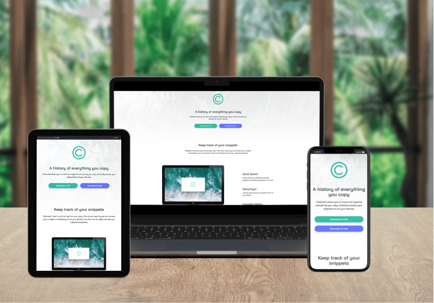
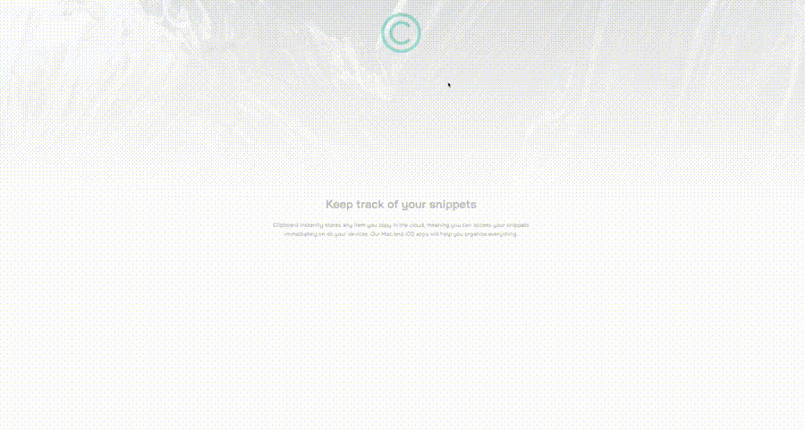

<div align="center">

  
  <h1 style="margin: 2rem 0 ">Frontend Mentor Challenges</h1>
  
  <p >
    Solution For Frontend Mentor Challenges
  </p>
  
  
<!-- Badges -->
<p >
  <a href="https://github.com/rio-rifaldi/clipboard-landing-page/graphs/contributors">
    
  </a>
  <a href="">
    
  </a>
  <a href="https://github.com/rio-rifaldi/clipboard-landing-page/network/members">
    
  </a>
  <a href="https://github.com/rio-rifaldi/clipboard-landing-page/stargazers">
    
  </a>
  <a href="https://github.com/rio-rifaldi/clipboard-landing-page/issues/">
    
  </a>
  <a href="https://github.com/rio-rifaldi/clipboard-landing-page/blob/master/LICENSE">
    
  </a>
</p>
   
<h4 style="display: flex; justify-content: center; gap:.6rem">
    <a href="https://rio-clipboard-landing-page.netlify.app">View site 🚀</a>
  <span> · </span>
    <a href="https://github.com/rio-rifaldi/clipboard-landing-page">Documentation 📕</a>
  <span> · </span>
    <a href="https://github.com/rio-rifaldi/clipboard-landing-page/issues/">Report Bug 🛠️</a>
  <span> · </span>
    <a href="https://github.com/rio-rifaldi/clipboard-landing-page/issues/">Request Feature 🖥️</a>
</h4>
</div>

<br />

<!-- About the Project -->
# 📌 About the Project


<!-- Screenshots -->
### 📸 responsive deisgn

<div align="center"> 
  
</div>

<!-- motion -->

### 👁️ preview
<div align="center"> 
  
</div>

<!-- language and tools -->
### 🧰 Language and tools
<br><br>
<a target="blank" href="https://developer.mozilla.org/en-US/docs/Web/JavaScript">
   
</a>
<a target="blank" href="https://developer.mozilla.org/en-US/docs/Web/CSS">
   
</a>
<a target="blank" href="https://developer.mozilla.org/en-US/docs/Web/HTML">
   
</a>
<a target="blank" href="https://tailwindcss.com/">
   
</a>
<a target="blank" href="https://vitejs.dev/">
   
</a>
<a target="blank" href="https://www.netlify.com/">
   
</a>
<a target="blank" href="https://gsap.com/">
   
</a>
<a target="blank" href="https://code.visualstudio.com/">
   
</a>
<br> <br><br>

  <!-- color pallete -->


### 🎨 Color pallete

<br>

| **hex** |                                    **color**                                    |
|:-------:|:-------------------------------------------------------------------------------:|
| #6173ff |  |
| #4c545d |  |
| #9fabb2 |  |
| #1e9483 |  |
| #4d5ccc |  |

<br>

# 📌 Getting Started

<!-- Run Locally -->
### Run Locally

Clone the project

```bash
  git clone https://github.com/rio-rifaldi/clipboard-landing-page.git
```

Go to the project directory

```bash
  cd clipboard-landing-page
```

Install dependencies

```bash
  pnpm install
```

Start the server

```bash
  pnpm run dev
```
